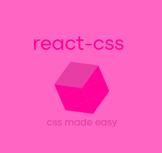

#  <div>reactCSS</div>

<span style="font-size: 20px;">REACTCSS SUPPORTS REACT AND REACT-DOM ONLY. USE REACT-NATIVE `StyleSheet` </span>

reactCSS is a way to implement CSS onto your react app.

## Why use reactCSS?

reactcss is just normal CSS, but you can actually feel like writing JavaScript when doing it. Also, you would not need a `styles.css` file for styles except if you want to select tags overall or do animations. Also, it supports typescript, commonJS (To be honest, i don't think you'll ever use CommonJS in a react project), and Modules.

## How to use it

reactCSS can be easily used by simply doing something like:

```js
import { StyleSheet } from "@afonso/react-css";

function App() {
  const Style1 = new StyleSheet({
    color: "blue",
  });
  const Style2 = new StyleSheet({
    backgroundColor: "white",
  });

  return (
    <>
      <h1 styles={Style1}>Hello world!</h1>
      <p styles={Style2}>reactCSS made the styles on this page.</p>
    </>
  );
}
```

## Where to use it

reactCSS currently works with react and react-dom. In this case, webpages. A better option to use for react-native styling is the package itself.

## How does reactCSS even work?

Might be how you expected it. It basically turns something like this:

```js
const styles = new StyleSheet({
  color: "blue",
});
```

to something like this:

```js
const styles = {
  color: "blue",
};
```

### What about settings that use kebab-case?

With reactCSS, all of our settings are converted into kebab-case after turning it into a object.

For example, we would turn `backgroundColor` into `background-color`.

## So, why did i do this project as a solo developer?

For fun. That's basically it. That's why i ask you, do not constantly beg me for updates, i'm just basically doing this as a hobby.

## Conclusion

That was a long one. So, if i were you, i'd say react-css is a good choice to make implementing CSS on react feel better. It's up to you, although.
